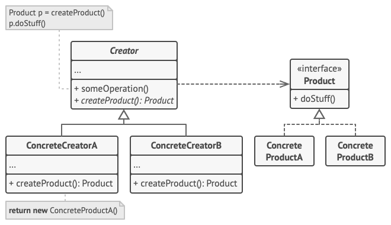

# Factory method
**Creational pattern**
- also known as **virtual constructor**

**Goal**: Factory Method separates product construction from the product use.
- easier to extend the product construction code independently from the rest of the code.
- to add a new product type to the app, you’ll only need to create a new creator subclass and override the factory method in it.

**How it's working**: Interface for creating an object, but subclasses decide which class to instantiate.
- lets a class defer instantiation to subclasses

**Factory Method** suggest that you replace direct object construction calls (using `new` operator).

## Diagram

You can declare the factory method `createProduct` as
`abstract` to force all subclasses to implement their own versions of 
the method. As an alternative, the base factory method can return some 
default product type.

## Pros and Cons
**Pros**:
- **Avoid tight coupling** between the creator and the concrete products.
- **Single Responsibility Principle**: You can move the product creation code into one place in the program, making the code easier to support.
- **Open/Closed Principle**: You can introduce new types of products into the program without breaking existing client code.

**Cons**:
- Code may become more complicated

## Shopping cart discount service Example
**Problem**: We want to calculate the discount, but there are multiple ways to do that.
