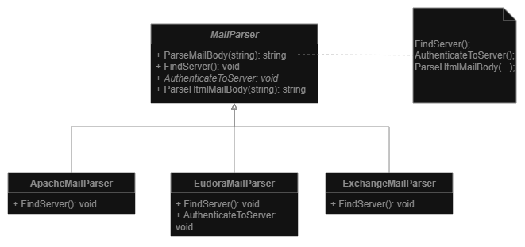

# Template method
**Behavioral pattern**

**Goal:** Defines the skeleton of an algorithm in the superclass but lets subclasses override specific steps of the algorithm without changing its structure.

## Diagram

1. **Abstract Class** declares methods that act as steps of an algorithm, as well as the actual template method which calls these methods in a specific order. The steps may either be declared abstract or have some default implementation.
2. **Concrete Classes** can override all the steps, **but not the template method itself**.

## Pros and Cons
**Pros:**
- You can let clients override only certain parts of a large algorithm, making them less affected by changes that happen to other parts of the algorithm.
- You can pull the duplicate code into a superclass.

**Cons:**
- Some clients may be limited by the provided skeleton of an algorithm.
- You might violate the **Liskov Substitution Principle** by suppressing a default step implementation via a subclass.
  Template methods tend to be harder to maintain the more steps they have.

---
# Examples
## Mail parser example
**Problem**: We created a mail parser service that for now supports only Apache. We want also to support Eudora and Exchange Mail. 
Parsing steps are the same, but the details (like Authentication) are different.

___
[Back to home page](../../../README.md)