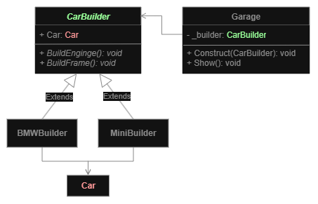

# Builder
**Creational pattern**

Goal: Construct complex objects step by step. Allows you to produce different types and representations of an 
object using the same construction code.
- Use this pattern when you have too many constructor overloads or some parameters are optional. 

## Diagram

- **Builder** interface declares product construction steps that are common to all types of builders.
- **Concrete Builders** provide different implementations of the construction steps. 
  - Concrete builders may produce products that **don’t follow** the common interface.
- **Director** class defines the order in which to call construction steps, so you can create and reuse specific configurations of products.

## Pros and Cons
**Pros**:
- You can construct objects step-by-step, defer construction steps or run steps recursively.
- You can reuse the same construction code when building various representations of products.
- Single Responsibility Principle. You can isolate complex construction code from the business logic of the product.

**Cons**:
- The overall complexity of the code increases since the pattern requires creating multiple new classes.

---
# Examples
## Car builder
**Problem**: We want to build a BMW car and a Mini car. The creation steps are almost the same.

## EF Core query builder
Web API specific example: [GitHub Gist](https://gist.github.com/Cometores/68403a960bfde7d1438eeed688e94703)

## DI options builder
Minimal example of ASP.NET-style service registration using IServiceCollection: [GitHub Gist](https://gist.github.com/Cometores/d544408b5d47310b592ee438909373a6)

___
[Back to home page](../../../README.md)