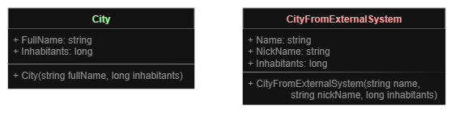
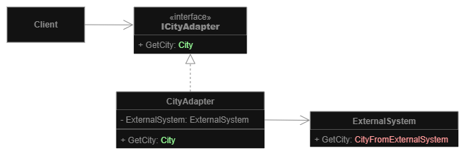
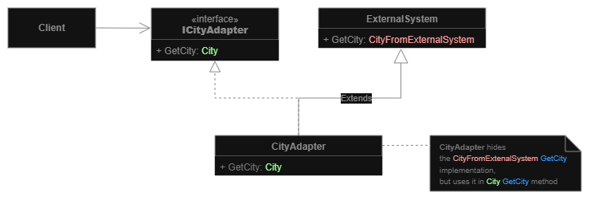

# Adapter
**Structural pattern**

**Goal**: Allow objects with **incompatible interfaces to collaborate**.

**How it's working**: An adapter wraps one of the objects to hide the complexity of conversion happening behind the scenes.
1. The adapter gets an interface, compatible with one of the existing objects.
2. Using this interface, the existing object can safely call the adapter’s methods.
3. Upon receiving a call, the adapter passes the request to the second object, but in a format and order that the second object expects.

Sometimes it’s even possible to create a two-way adapter that can convert the calls in both directions.

## Diagram
## Object Adapter Diagram
**Object composition principle**: the adapter implements the interface of one object and wraps the other one.

1. **Client** contains the business logic of the program
2. **Client Interface** describes a protocol that other classes must follow to be able to collaborate with the client code.
3. **Service** is some useful class (usually 3rd-party or legacy). The client can't use this class directly because it has an incompatible interface.
4. **Adapter** is able to work with both the client and the service: it implements the client interface, while wrapping the service object. The adapter receives calls from the client via the client interface and translates them into calls to the wrapped service object in a format it can understand.

Client code doesn’t get coupled to the concrete adapter class as long as it works with the adapter via the client interface.
- You can introduce new types of adapters into the program without breaking the existing client code. This can be useful when the interface of the service class gets changed or replaced: you can just create a new adapter class without changing the client code.

## Class Adapter Diagram
**Inheritance**: the adapter inherits interfaces from both objects at the same time.

**Class Adapter** doesn't need to wrap any objects because it inherits behaviors from both the client and the service. The adaptation happens within the overridden methods. The resulting adapter can be used in place of an existing client class.

# Pros and Cons
**Pros:**
- **Single Responsibility Principle**: You can separate the interface or data conversion code from the primary business logic of the program.
- **Open/Closed Principle**: You can introduce new types of adapters into the program without breaking the existing client code, as long as they work with the adapters through the client interface.

**Cons:**
- The overall complexity of the code increases because you need to introduce a set of new interfaces and classes.

---
# Examples
## City adapter example
**Problem**: We have a `City` class defined in our code, but now we want to use an external library 
that works with the city in another format. We can't just change the city definition to match the library's format, so we
create an adapter that converts the external city to our format.

There are two ways to implement this:
1) Object adapter (composition)

2) Class adapter (inheritance)

___
[Back to home page](../../../README.md)