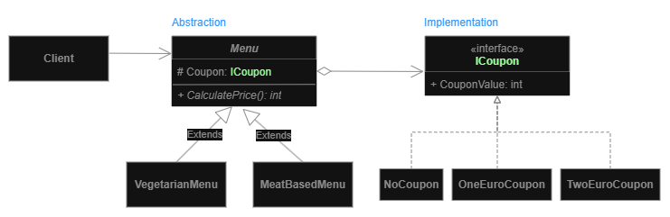

# Bridge
**Structural pattern**

**Goal:** Lets you split a large class or a set of closely related classes into two separate hierarchies—abstraction and 
implementation—which can be developed independently of each other.
- use the bridge pattern when you want to extend a class in several *orthogonal* (independent) dimensions.
- when you want to divide and organize a monolithic class that has several variants of some functionality

## Diagram

1. **Abstraction** provides high-level control logic. It relies on the implementation object to do the actual low-level work.
2. **Implementation** declares the interface that’s common for all concrete implementations. An abstraction can only communicate with an implementation object via methods that are declared here.
   - The abstraction may list the same methods as the implementation, but usually the abstraction declares some complex behaviors that rely on a wide variety of primitive operations declared by the implementation.
3. **Concrete Implementations** contain platform-specific code.
4. **Refined Abstractions** provide variants of control logic. Like their parent, they work with different implementations via the general implementation interface.
5. Usually, the **Client** is only interested in working with the abstraction. However, it’s the client’s job to link the abstraction object with one of the implementation objects.

## Pros and Cons
**Pros:**
- You can create platform-independent classes and apps.
- The client code works with high-level abstractions. It isn’t exposed to the platform details.
- **Open/Closed Principle**. You can introduce new abstractions and implementations independently from each other.
- **Single Responsibility Principle**. You can focus on high-level logic in the abstraction and on platform details in the implementation.

**Cons:**
-  You might make the code more complicated by applying the pattern to a highly cohesive class.

---

# Examples

## Food menu bridge
**Problem:** We have different food menus and also different coupons for discounts. Over time, we want to add more menus and coupons.

___
[Back to home page](../../../README.md)