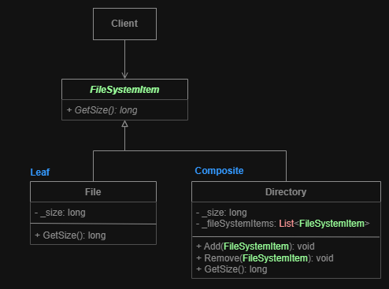

# Composite
**Structural pattern**

Using the Composite pattern makes sense only when the core model of your app can be represented as a tree.

**Goal:** Lets you compose objects into tree structures and then work with these structures as if they were individual objects.

## Diagram

1. **Component** interface describes operations that are common to both simple and complex elements of the tree.
2. **Leaf** is a basic element of a tree that doesn’t have sub-elements.
    - Usually, leaf components end up doing most of the real work, since they don’t have anyone to delegate the work to.
3. **Container** (aka composite) is an element that has sub-elements: leaves or other containers. A container doesn’t know the concrete classes of its children. It works with all sub-elements only via the component interface.
    - Upon receiving a request, a container delegates the work to its sub-elements, processes intermediate results and then returns the final result to the client.
4. **Client** works with all elements through the component interface. As a result, the client can work in the same way with both simple or complex elements of the tree.

## Pros and Cons
**Pros:**
- You can work with complex tree structures more conveniently: use polymorphism and recursion to your advantage.
- Open/Closed Principle. You can introduce new element types into the app without breaking the existing code, which now works with the object tree.

**Cons:**
- It might be difficult to provide a common interface for classes whose functionality differs too much. In certain scenarios, you’d need to overgeneralize the component interface, making it harder to comprehend.
___

# Examples
## File system composite example
**Problem:** Imagine we have a file system that consists of files and folders. We want to calculate the total size of all files in the file system.
For a folder it's mainly the size of all files it contains. Composite pattern lets you count the size recursively.

___
[Back to home page](../../../README.md)