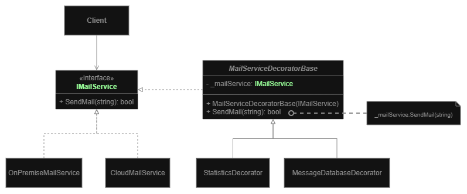

# Decorator
**Structural pattern**
- also known as **Wrapper**

**Goal:** Attaching new behaviors to objects by placing these objects inside special wrappers that contain the behaviors. 

**How it's working:** wrapping & wrapping to extend functionality.
- **Wrapper** is an object that can be linked with some **target** object.
- **Wrapper** implements the same interface as the **wrapped** (**target**) object.
- Client code would need to wrap a basic object into a set of decorators that match the client’s preferences.
  - Resulting objects will be structured as a stack.
  - Last decorator in the stack would be the object that the client actually works with.

    
## Diagram

1. **Component** declares the common interface for both wrappers and wrapped objects.
2. **Concrete Component** is a class of objects being wrapped. It defines the basic behavior, which can be altered by decorators.
3. **Base Decorator** class has a field for referencing a wrapped object. 
   - The field’s type should be declared as the component interface so it can contain both concrete components and decorators. The base decorator delegates all operations to the wrapped object.
4. **Concrete Decorators** define extra behaviors that can be added to components dynamically. 
   - Concrete decorators override methods of the base decorator and execute their behavior either before or after calling the parent method.
5. **Client** can wrap components in multiple layers of decorators, as long as it works with all objects via the component interface.

## Pros and Cons
**Pros:**
- You can extend an object’s behavior without making a new subclass.
- You can add or remove responsibilities from an object at runtime.
- You can combine several behaviors by wrapping an object into multiple decorators.
- Single Responsibility Principle. You can divide a monolithic class that implements many possible variants of behavior into several smaller classes.

**Cons:**
- It’s hard to remove a specific wrapper from the wrappers stack.
- It’s hard to implement a decorator in such a way that its behavior doesn’t depend on the order in the decorators stack.
- The initial configuration code of layers might look pretty ugly.
___

# Examples
## Mail service example
**Problem:** We had two Mail services, that we wanted to extend with statistics and database logging. 
Instead of creating a new inheritor for each service, we create a decorator that can be used with each service and combined with additional functionality that will come in the future.

___
[Back to home page](../../../README.md)